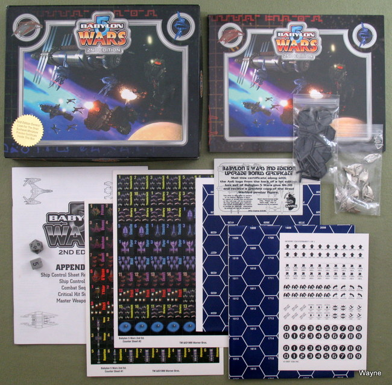
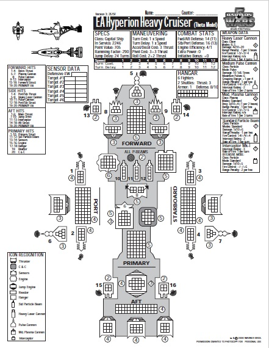

***PLEASE BE AWARE THIS IS OLD INCOMPLETE CODE AND (THE UI IN PARTICULAR) REQUIRES UPDATING***

An ***IN PROGRESS*** *Java* implementation of the [Babylon 5 Wars](https://en.wikipedia.org/wiki/Babylon_5_Wars) tabletop game by [Agents of Gaming](https://en.wikipedia.org/wiki/Agents_of_Gaming).

## Background
[Babylon 5](https://en.wikipedia.org/wiki/Babylon_5) is the first sci-fi series that I really got invested in, mainly due to its overarching storyline spanning multiple seasons. It was also one of the first TV series to use CGI.

As an avid tabletop gamer, [Babylon 5 Wars](https://en.wikipedia.org/wiki/Babylon_5_Wars) by [Agents of Gaming](https://en.wikipedia.org/wiki/Agents_of_Gaming), now long out of print, also found its way into my heart. This detailed system focuses on small scale space combat between ships, fighters, and fixed installations, played out on a (typically 42x30) hex grid, in order to recreate battles from the show.

At the core of the game is the *Ship Control Sheet* (SCS). A SCS contains all statistics and information for using a given ship in-game, including a graphical representation of the different ships sections (e.g. FORWARD, PORT), along with all ships systems (e.g Thruster, C & C) contained within each section.

During combat resolution, damage would be applied to the sections and systems of the target ship, based on the relative bearing between attacker and target. This would result in marking boxes on the SCS as damage is applied to the appropriate sections and systems. Whole sections can fall off a ship if its structure is destroyed, and systems can become less effective as they are damaged, until a ship is either out of commission or destroyed outright.

In the late 2000's, finding myself with too much time on my hands, and wanting a challenge, I decided to embark on a digital implementation. 

## Implementation
Java is my first love as a programming language, and this was an opportunity to engage with it in a few different aspects than I typically would in my day job.

The current partial implementation mainly focuses around a digital representation of the Ship Control Sheets; defining and persisting SCSs as XML, reconstituting these into the appropriate classes, bringing together with SVG snippets to create a graphical SCS, and finally exporting as PDF if desired. Also implemented is the logic for applying damage to ship sections and systems, based on a given angle for incoming fire.
 
Eventually though, after many (mostly fun) hours, I started thinking about the longer term, and decided the project would be better implemented in the likes of C++ and OpenGL, with an agnostic setting. 

Shortly afterwards however, life, as it tends to do, got in the way, and the project was left to gather dust... 

## Future
I am once again getting the itch, and are not currently using Java in my normal work duties, so have dusted off the project. 

For the time being I plan to:

- ~~Upload the code to GitHub~~
- ~~Get the existing project running with a current Java version~~
- Implement [Spring](https://spring.io/) server-side to support a new UI
- Implement a new [React](https://reactjs.org/) UI for displaying SCSs
- Revisit and refactor some coding choices (e.g. separation of concerns)
